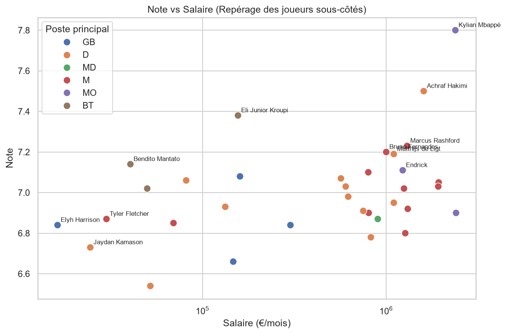
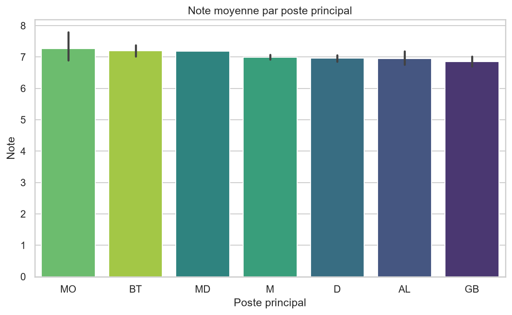
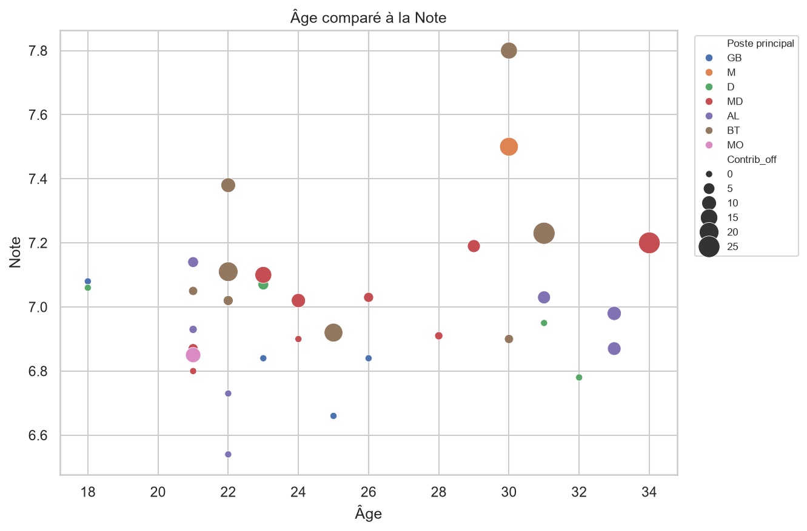
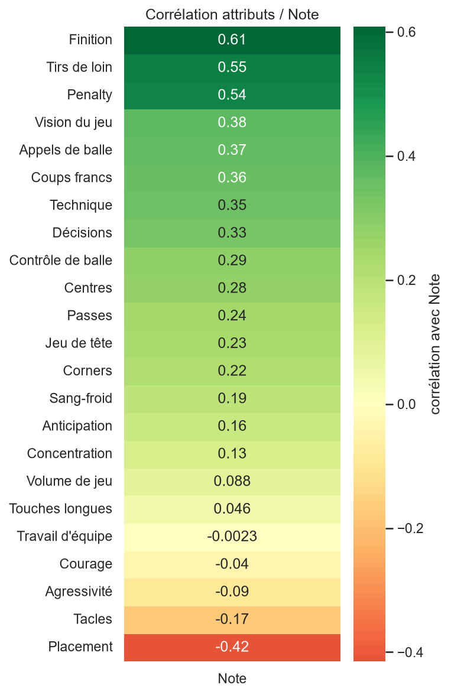
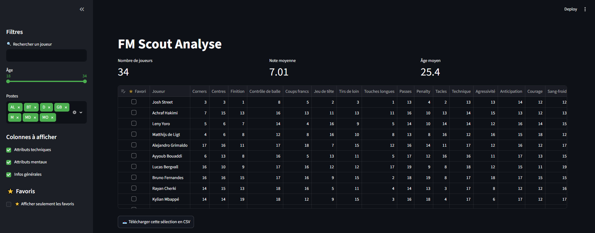
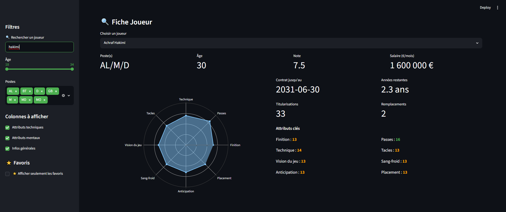
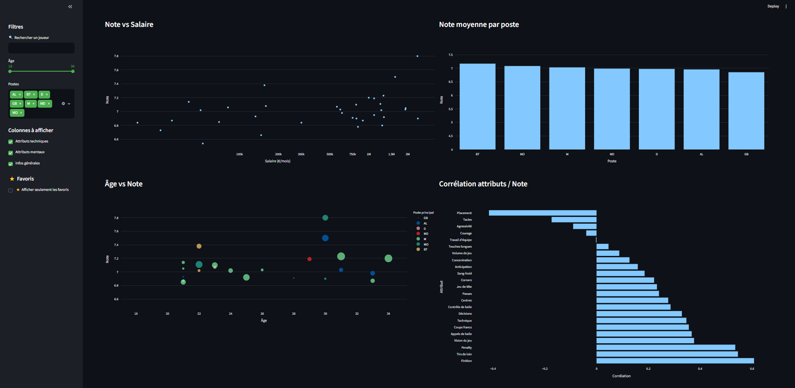

# ⚽ FM26 Scouting Analysis 
[](https://github.com/sirnasr0/fm26-analytics/actions/workflows/tests.yml)

Analyse de données de scouting sous **Football Manager 26** : extraction, nettoyage, exploration statistique et dashboard interactif pour identifier les joueurs sous-cotés, les jeunes à potentiel, et comparer les performances par poste.

Projet réalisé pour m'entraîner sur un pipeline complet de data science : **collecte → nettoyage → exploration → visualisation → dashboard interactif**, sur un jeu de données réel (bien que fictif dans son contenu).

> 🎓 Projet personnel réalisé dans le cadre de ma recherche d'alternance en data science.


## 🎯 Objectifs

- Construire un pipeline de nettoyage robuste à partir de données brutes hétérogènes (texte, formats mixtes, valeurs manquantes)
- Fusionner plusieurs sources de données sur une clé commune
- Explorer les corrélations entre attributs de jeu et performance globale (`Note`)
- Repérer les joueurs sous-cotés (bon niveau / faible salaire) et les jeunes à fort potentiel
- Proposer un dashboard interactif pour explorer l'effectif dynamiquement

## 🗂 Structure du projet

```
fm26-analytics/
├── README.md
├── requirements.txt
├── .gitignore
├── app.py                  ← dashboard Streamlit
├── .streamlit/
│   └── config.toml         ← thème visuel du dashboard
├── data/
│   ├── raw/                ← les 3 CSV bruts (export FM26)
│   └── processed/          ← fm26_data_clean.csv (données nettoyées)
├── notebooks/
│   └── fm26_analyse.ipynb
├── reports/
│   └── figures/            ← visualisations exportées
├── src/
│   └── nettoyage.py         ← fonctions de nettoyage réutilisables et testées
└── tests/
    └── test_nettoyage.py    ← tests unitaires (pytest)
```

## 🛠 Stack technique

- **Python 3.11**
- `pandas` — manipulation et nettoyage de données
- `matplotlib`, `seaborn` — visualisation (notebook)
- `plotly` — visualisation interactive (dashboard)
- `streamlit` — dashboard interactif
- `Jupyter Notebook` — exploration
- `pytest` — tests unitaires sur les fonctions de parsing

## 📊 Aperçu des résultats (notebook)

| Note vs Salaire | Note moyenne par poste |
|---|---|
|  |  |

| Âge vs Note | Corrélation attributs / Note |
|---|---|
|  |  |

## 📱 Dashboard interactif

Un dashboard Streamlit permet d'explorer l'effectif dynamiquement, sans avoir besoin d'ouvrir le notebook.



**Fonctionnalités :**
- 🔍 Recherche de joueur par nom
- 🎚 Filtres par âge, poste(s) et catégorie de colonnes (technique / mental / général)
- ⭐ Système de favoris (persistant pendant la session)
- 📊 KPIs dynamiques (nombre de joueurs, note moyenne, âge moyen) selon les filtres appliqués
- 📈 4 graphiques interactifs (Note vs Salaire, Note par poste, Âge vs Note, Corrélation attributs/Note)
- 📥 Export CSV de la sélection filtrée
- 🧾 Fiche joueur détaillée : radar chart des attributs clés, infos contractuelles, attributs colorés selon leur niveau (rouge/orange/vert)




**Lancer le dashboard en local :**
```bash
pip install -r requirements.txt
streamlit run app.py
```

## 🚀 Installation

```bash
git clone https://github.com/sirnasr0/fm26-analytics.git
cd fm26-analytics
python -m venv venv
source venv/bin/activate  # Windows : venv\Scripts\activate
pip install -r requirements.txt
```

## 📈 Pipeline de données

1. **Export** — extraction des données FM26 via un plugin dédié (3 fichiers CSV : attributs techniques, mentaux, infos générales)
2. **Fusion** — jointure sur la colonne `Joueur` (34 joueurs)
3. **Nettoyage** — parsing des champs texte hétérogènes :
   - `Matchs disputés` → `Titularisations` / `Remplacements`
   - `Salaire` → valeur numérique normalisée (€/mois)
   - `Montant transfert` → bornes min/max (gestion des fourchettes, "Pas à vendre", unités K/M)
   - `Note` → conversion virgule → point
   - `Expire le` → date, puis calcul des années restantes de contrat
   - `Position` → liste dédoublonnée des postes possibles
4. **Export** → `data/processed/fm26_data_clean.csv` (34 lignes × 40 colonnes)
5. **Exploration** → statistiques descriptives, classements, comparaisons par poste, corrélations
6. **Dashboard** → exploration interactive de l'effectif (voir section ci-dessus)

Les fonctions de nettoyage les plus complexes (`convertir_montant`, `extraire_postes`, `extraire_matchs`) sont extraites dans `src/nettoyage.py` et couvertes par des tests unitaires (voir ci-dessous), plutôt que codées en dur dans le notebook.

## 🧪 Tests

Les fonctions de parsing critiques (gestion des fourchettes de prix, formats K/M, extraction des postes multiples) sont testées avec `pytest` :

```bash
pip install -r requirements.txt
pytest
```

## 🗺 Roadmap

- [ ] Score composite pour détecter automatiquement les joueurs sous-cotés / jeunes à potentiel
- [ ] Récupération des attributs physiques et des données d'entraînement
- [ ] Tests automatiques à chaque push (GitHub Actions)
- [ ] Clustering de profils de joueurs (regroupement par style de jeu statistique)
- [ ] Analyse des performances match par match
- [ ] Proposition automatique de composition d'équipe (11 titulaires + remplaçants) sous contrainte de postes

## 📄 Licence

Ce projet est sous licence MIT — voir [LICENSE](LICENSE).

## 👤 Auteur

ABA-HADDOU Nasr ALLAH — [LinkedIn](https://www.linkedin.com/in/nasr-allah-aba-haddou-234a013a7/) · [GitHub](https://github.com/sirnasr0)